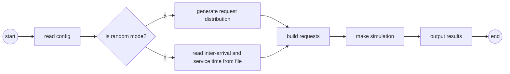
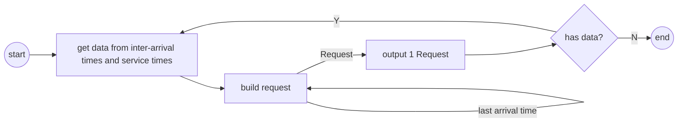
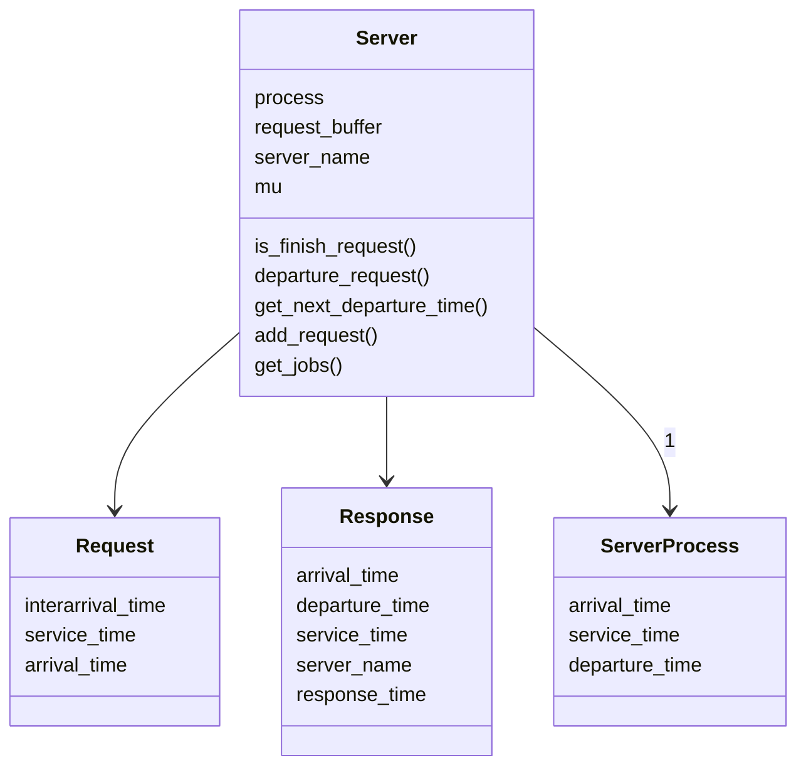
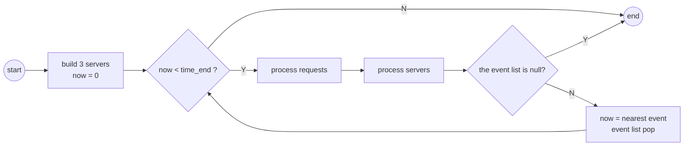
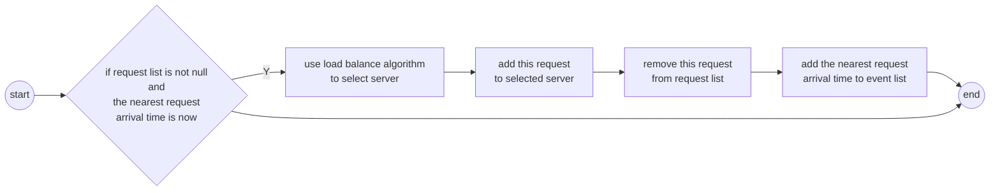
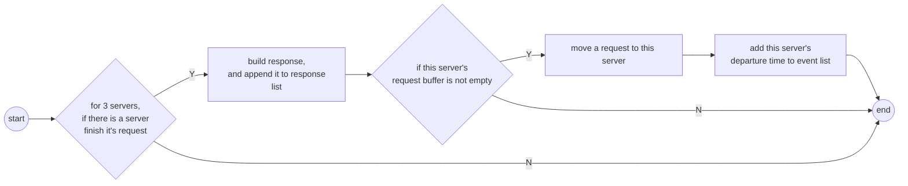

# Project report

[toc]

## Simulation

### Problem analysis

According to the project's description, we know:

- The server farm consists of 3 servers, each has an infinite queue, and a dispatcher with negligible process time.
- The dispatcher can distribute requests according to servers' status.
- Server 1 and server 2 have the same process speed 1, and server 3 has process speed f.
- All of the servers are FCFS (first come first serve).

We need to build a simulation program based on these rules. And it must have the following functions:

- Do simulation based on input requests.
- Do simulation based on parameters, which would be used to generate request distribution.
- Output simulation results.

### Program design

We have trace mode and random mode to generate different requests. And here is the program flow chart.



#### Random mode

In random mode, we need to generate the requests' distribution based on the input parameters.

##### inter-arrival time

According to part 5.1.1 we know that the inter-arrival times of the requests $a_k = a_{1k}a_{2k}$

And $a_{1k}$ is exponentially distributed with a mean arrival rate $\lambda$. Which means the PDF of $a_{1k} $ is

$$
f(t) = 
\begin{cases}
   \lambda e^{-\lambda t} &\text{if } t \ge 0 \\
   0 &\text{if } t \lt 0
\end{cases}
$$

Then the CDF of $a_{1k}$ is 
$$
F(t) = \int_{0}^{t} f(t) dt = 1 - e^{-\lambda t}
$$

So based on lecture, we can use an uniformly distributed $u(t)$ in $(1,0)$ to generate the exponentially distribution.

$$
\begin{aligned}
D(u(t)) &= F^{-1}(u(t)) \\
&= - \log \frac{1-u(t)}{\lambda}
\end{aligned}
$$

And here is the python code to generate $a_{1k}$ with $\lambda = 2$ and 10000 point with uniformly distributed $u(t)$

```python {.line-numbers}
import numpy as np 

n = 10000
lamb = 2

u = np.random.random((n,))
exp_distribution = -np.log(1-u)/lamb
```

Then We use a simple code to plot the distribution I generated, to get an intuitive view.

```python {.line-numbers}
def plot_expected(x, expected_func, name = None):
    nb = 50 # Number of bins in histogram 
    freq, bin_edges = np.histogram(x, bins = nb, range=(0,np.max(x)))

    # Lower and upper limits of the bins
    bin_lower = bin_edges[:-1]
    bin_upper = bin_edges[1:]
    # expected number in each bin
    y_expected = n*(expected_func(bin_lower)-expected_func(bin_upper))

    bin_center = (bin_lower+bin_upper)/2
    bin_width = bin_edges[1]-bin_edges[0]

    plt.bar(bin_center,freq,width=bin_width)
    plt.plot(bin_center,y_expected,'r--',label = 'Expected',Linewidth =3)
    plt.legend()
    
    if name is not None:
        plt.savefig(name)
```

These code can be found in `distribution.ipynb`. So the distribution of $a_{1k}$ is

```python {.line-numbers}
plot_expectd(exp, lambda x: np.exp(-lamb * x), name='exp.png')
```
@import "../exp.png"

Then we aims to generate distribution of $a_{2k}$. We notice that $a_{2k}$ is an uniformly distribution in the interval $[a_{2l},a_{2u}]$. We can write a linear transformation to generate this distribution.

```python {.line-numbers}
a2k = (a2u - a2l) * u + a2l
```

So we can build the inter-arrival time distribution using $a_k = a_{1k} a_{2k}$.

##### service time

According to the project description, we know the PDF of service time distribution is

$$
g(t) = 
\begin{cases}
    0 &\text{if } 0 \le t \le \alpha\\
    \frac{\gamma}{t^\beta} &\text{if } \alpha \le t\\
\end{cases}
$$

and $\gamma = \frac{\beta - 1}{\alpha ^{1-\beta}}$.
Then the CDF of service time distribution is
$$
G(t) = \int_{0}^{t} g(t) dt = 
\begin{cases}
0 &\text{if } 0 \le t \le \alpha\\
\frac{\gamma x ^{1-\beta}}{1-\beta} &\text{if } \alpha \le t\\
\end{cases}
$$

So based on lecture, we can use an uniformly distributed $u(t)$ in $(1,0)$ to generate the service time distribution.

$$
\begin{aligned}
D(u(t)) &= G^{-1}(u(t)) \\
&= (\frac{(\beta - 1)}{\gamma} u(t))^{\frac{1}{1-\beta}}
\end{aligned}
$$

And here is the python code to generate $a_{1k}$ with $\alpha = 0.150
\text{ and }\beta = 3.600$ and 10000 point with uniformly distributed $u(t)$

```python {.line-numbers}
n = 1000
alpha = 0.150
beta = 3.600
gama = (beta - 1)/(alpha ** (1-beta))

u = np.random.random((n,))
service_time = ( (beta - 1)/gama * u )**(1/(1 - beta))
```

These code can be found in `distribution.ipynb`. And I also use `plot_expected()`to plot the distribution I generated, to get an intuitive view of service time.

```python {.line-numbers}
plot_expectd(t, lambda x: gama / (x ** beta), name='service_time.png')
```
@import "../service_time.png"

#### Trace mode

We could read inter-arrival time and service time from the given files. Then we can uses these data to build the requests.

#### Build requests

We can use the inter-arrival time and service time data to build our request. Which consist of the following components.

- interarrival_time
- service_time
- arrival_time

And we use a python class to represent `Request`. The python code is in `main_ex.py`, named as `Request`.

```python {.line-numbers}
class Request:

    def __init__(self, interarrival_time, service_time, arrival_time):
        self.interarrival_time = interarrival_time
        self.service_time = service_time
        self.arrival_time = arrival_time

    def setArrivalTime(self, arrival_time):
        self.arrival_time = arrival_time

    def __str__(self):
        return str({
            'interarrival_time': self.interarrival_time,
            'service_time': self.service_time,
            'arrival_time': self.arrival_time
        })

    def __repr__(self):
        return self.__str__()
```

In build requests' part, we need to use inter-arrival times to calculate the arrival times. Here is the flow char.



And here is the python code.

```python {.line-numbers}
request_list = []
last_arrival = 0
for i in range(len(interarrival_time_list)):
    request_list.append(Request(
         interarrival_time_list[i],
         service_time_list[i], 
         last_arrival + interarrival_time_list[i]))
    last_arrival += interarrival_time_list[i]
```

#### Simulation

##### UML

After we built the requests, we need use computer program to make simulation. We need 3 class to represent the states in out simulation.

- Response
- ServerProcess
- Server

The UML is showing as follow.



The `Response` class is used to make a response to a request, which includes the following contents.

- arrival_time: the arrival time of this request.
- departure_time: the response time of this request.
- service_time: the service time needed to process this request.
- server_name: which server did this process.
- response_time: the response time of this request.

And the python code is in `main_ex.py`, named as `Response`.

The `ServerProcess` class is used to represent the internal state of servers. Which includes

- arrival_time: the arrival time of this request.
- departure_time: the response time of this request.
- service_time: the service time needed to process this request.

And the python code is in `main_ex.py`, named as `ServerProcess`.


The `Server` class is the abstraction of server. It has the following attributes.

- process: the on processing status, which is a ServerProcess.
- request_buffer: the requests queue of this server.
- server_name: the server name.
- mu: the processing speed of this server, typically server1 and server2 is 1, server3 is $\lambda$.

We also add some functions to this class, which would be very helpful when making a simulation.

- is_finish_request: see if this server finish its request.
- departure_request: departure the request.
- get_next_departure_time: get the departure time of this server.
- get_jobs: get the number of requests in this server (numbers in queue + server)

And the python code is in `main_ex.py`, named as `Server`.

##### Simulation flow

Then we could design our simulation flow as follow.



There are 2 sub routines in the simulation process.

- process requests
- process server

For process request routine, we have.



For process servers routine, we have.



And the python code of this simulation program is in `main_ex.py`, named as `simulation()`.

## Design problems

### Basic ideas

Here is the basic ideas to determine the suitable value of d for load balance algorithms.

For each of the d values, do the following steps. 

1. Generate requests: for CRN method, we want use the same requests for different d value to reduced the confidence interval.
2. Replication experiments: for a value of d, repeat simulations n times using different requests.
3. Transient removal: get the mean response time of steady state from each simulation.
4. Calculate confidence interval.

#### Generate requests

We need to build a set of requests for the CRN method and Independent replication. And this can be found in `design problem.ipynb`.

```python {.line-numbers}
# build requests
times = 10

requests = []
for i in range(times):
    requests.append(build_request_list_random(lamb, a2l,a2u,alpha,beta, n = 50000))
```

#### Replication experiments

And we  also can write code to make the replication experiments. And this can be found in `design problem.ipynb`.

```python {.line-numbers}
# independent replication experiments
def get_ravg(d,times=3, version = 1, time_end=5000):
    ravg_list = []
    for i in range(times):
        req = copy.deepcopy(requests[i])
        rr = simulation(req, version, d, f, time_end) 
        response_time = [r.response_time for r in rr]
        ravg_list.append(sum(response_time) / len(response_time))

    return np.array(ravg_list)
```

Here we plot the confidence interval of different replication numbers (d = 1, using version 1).

@import "./experiment.png"


From this plot, we choose to use **3** replica experiments. Because it is good enough, and further experiments can not improve the confidence interval


#### Transient removal

Then, let's take a look at the means response time of first k request. Using the following python code, which can be found in `design problem.ipynb` to plot. 

```python {.line-numbers}
# means response time of first k request.
d = 1
time_end = 5000
version = 1

request_list = build_request_list_random(lamb, a2l,a2u,alpha,beta)
rr = simulation(request_list, version, d, f, time_end, 
                generate_request=lambda now: 
                    build_request_list_random(lamb, a2l,a2u,alpha,beta, now=now))
response_time = [r.response_time for r in rr]

avg = 0
avg_list = []
for i in range(1, len(response_time)):
    avg_list.append(sum(response_time[:i]) / i)

plt.plot(avg_list)
plt.savefig('first_k.png')
```

@import "./first_k.png"

From this figure, we found that remove first 10000 response would be a good choice to calculate the means response time of steady state.

#### Confidence interval

From the lecture we can write code to calculate the confidence interval. And this can be found in `design problem.ipynb`.

```python {.line-numbers}
# compute error value
def get_error_value(ravg):
    p = 0.95 
    num_tests = ravg.shape[0]
    mf = t.ppf(1-(1-p)/2,num_tests-1)/np.sqrt(num_tests)
    return np.std(ravg,ddof=1) * mf
```

### Version 1

For version 1 algorithm, we found that the core statement is line 4, `else if ns == 0 or ns <= n3 - d` , which means the value from d-1 (not included) to d have the same behaviors. So we use $d_i = i \text{ for } i \in [0, \inf] \cap N$ to find the best $d_i$.

1. for each $d_i$, do **3** replica experiments.
2. for each experiments, remove the first **10000** response, then calculate the mean response time for this experiment.
3. compute the confidence interval with $\alpha = 0.95$, for this 5 mean response time.
4. plot these confidence interval.

Here is the first 10 di's confidence interval of mean response time.

@import "./v1.png"

From this figure, we can find that the best value of d for **Version 1** algorithm is **1.0**. The code used here is showing below, and can also find in `design problem.ipynb`.

```python {.line-numbers}
max_d = 10
dec = 1

x_ticks = [str(i/dec) for i in range(max_d * dec)]
x1 = []
y1 = []
error = []
for i in range(0,max_d * dec):
    d = i / dec
    ravg = get_ravg(d, times = 3)
    x1.append(i)
    y1.append(np.mean(ravg))
    error.append(get_error_value(ravg))
    
plt.errorbar(x=x1, y=y1, yerr=error, color="black", capsize=3,
             linestyle="None",
             marker="s", markersize=7, mfc="black", mec="black")


plt.xticks(x1, x_ticks, rotation=90)

plt.tight_layout()
plt.show()
```

### Version 2

For version 2 algorithm, we found that the core statement is line 4, `else if ns == 0 or ns <= n3/f - d` . We use $d_i = \frac{i}{10} \text{ for } i \in [0, \inf] \cap N$ to find the best $d_i$.

1. for each $d_i$, do **3** replica experiments.
2. for each experiments, remove the first **10000** response, then calculate the mean response time for this experiment.
3. compute the confidence interval with $\alpha = 0.95$, for this 5 mean response time.
4. plot these confidence interval.

Here is the first 20 di's confidence interval of mean response time.

@import "./v2.png"

From this figure, we can find that the best value of d for **Version 2** algorithm is **from 0 to 0.3**. And we choose to use $d_2=0.3$ as our d value. The code used here is showing below, and can also find in `design problem.ipynb`.

```python {.line-numbers}
max_d = 2
dec = 10

x_ticks = [str(i/dec) for i in range(max_d * dec)]
x1 = []
y1 = []
error = []
for i in range(0,max_d * dec):
    print(i)
    d = i / dec
    ravg = get_ravg(d, version = 2, times = 3)
    x1.append(i)
    y1.append(np.mean(ravg))
    error.append(get_error_value(ravg))
    
plt.errorbar(x=x1, y=y1, yerr=error, color="black", capsize=3,
             linestyle="None",
             marker="s", markersize=7, mfc="black", mec="black")


plt.xticks(x1, x_ticks, rotation=90)

plt.tight_layout()
plt.savefig('v2.png')
```

### Compare algorithm

Based on the work on version 1 and version 2. we know the best d values.

- For version 1: $d_1 = 1$
- For version 2: $d_2 = $

To compare these 2 systems' performance, we did the following jobs.

1. do **3** replica experiments.
2. for each experiments, remove the first **10000** response, then calculate the mean response time for this experiment.
3. compute the confidence interval with $\alpha = 0.95$, for this 5 mean response time.
4. plot these confidence interval.

Here is the confidence interval of these systems.

@import "./compare.png"

From this figure, we can find that CIs overlap and mean of a system is in the CI of the other. So they are **not different**.

The code used here is showing below, and can also find in `design problem.ipynb`.

```python {.line-numbers}
# compare
d1 = 1
d2 = 0.3

x_ticks = ['version 1', 'version 2']
x1 = [1, 2]
y1 = []
error = []

print('v1')
ravg = get_ravg(d1, version = 1, times = 3)
y1.append(np.mean(ravg))
error.append(get_error_value(ravg))

print('v2')
ravg = get_ravg(d2, version = 2, times = 3)
y1.append(np.mean(ravg))
error.append(get_error_value(ravg))
    
plt.errorbar(x=x1, y=y1, yerr=error, color="black", capsize=3,
             linestyle="None",
             marker="s", markersize=7, mfc="black", mec="black")

plt.xticks(x1, x_ticks, rotation=90)

plt.tight_layout()
plt.savefig('compare.png')
```